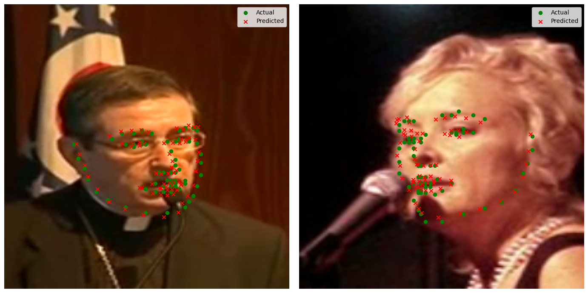

# Facial Recognition and Landmarks Detection

## Project description

__The project:__ An interactive advertising campaign in the mall to increase visitor engagement and increase sales.

__Client:__ An advertiser interested in innovative methods of attracting customers.

__Task:__ Creating a system that identifies loyal customers and adapts advertising content in real time based on their reactions and emotions.

__Decision:__
+ **Face classification model:** Identification of regular customers to offer personalized promotions and discounts.
+ **Keypoints detection model:** Analysis of visitors' reactions to commercials and interactive stands.

__How it works:__
Cameras in the mall identify regular customers and offer them personalized discounts and offers.
Interactive advertising stands track the reactions of visitors and adapt the content depending on their emotions and engagement.
The system offers additional information or discounts when identifying interest in a particular product.
The advertiser receives data on the effectiveness of the campaign to optimize strategies.

## Data overview

This dataset is a processed version of the YouTube Faces Dataset, that contained short videos of celebrities from YouTube. There are multiple videos of each celebrity (up to 6 videos per celebrity). The original videos were cropped around the faces and only 240 consecutive frames were kept for each original video.
There are 828 individuals with a total number of 260,399 frames.
Each .npz file contains four columns: 
1. ['colorImages'] containing arrays of the image colour values 
2. ['boundingBox'] containing the rectangle hand applied to the image to locate the face 
3. ['landmarks2D'] containing 68 sets of (x, y) coordinates representing landmark locations 
4. ['landmarks3D'] containing 68 sets of (x, y, z) coordinates representing landmark locations

  

## Justification of the approach

+ __Face Recognition__:

I decided to use the Face Classification model __with keypoints as features__. The keypoints of the face are unique patterns that allow you to reliably identify each person and to efficiently extract unique facial characteristics that remain stable under various conditions, such as facial expressions or viewing angles.

  

In addition, the usage of keypoints reduces the dimensionality of the data, which simplifies the process of training the model and increases its performance. Thus, I achieved 93% accuracy in Facial Recognition with both KNN and Feed Forward Neral Network.

  
 

+ __Facial Landmarks Detection__:
  
This task was solved using Convolutional Neural Network. I tried both a custom one with the selection of different parameters and pretrained ones (ResNet18, EfficientNet, MobileNetV2) __with fune-tuning__ on my data. __MobileNetV2__ turned out to be the best in quality and the fastest.

  

## Project Structure

+ `Facial_recognition.ipynb` - clustering and facial classification methods
+ `CustomCNN_landmarks_detection.ipynb` - custom CNN for landmarks detection
+ `Landmarks_Detection_Pretrained_models.ipynb` - pretrained models with fune-tuning for landmarks detection
+ `models` - all the models present in the project are here
+ `dfExpanded.csv` - contains all the frames with the corresponding videoIDs and encoded actual names
